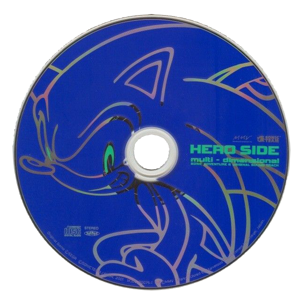
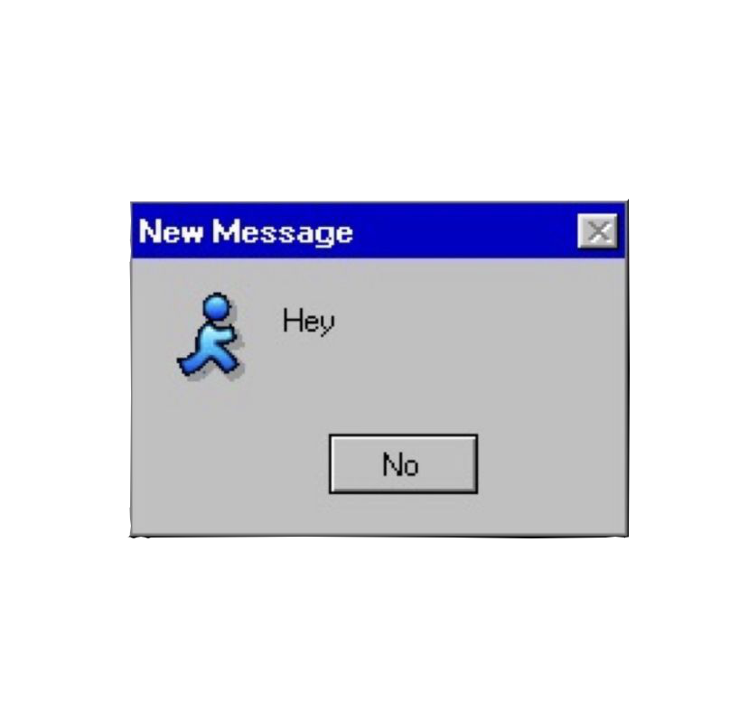
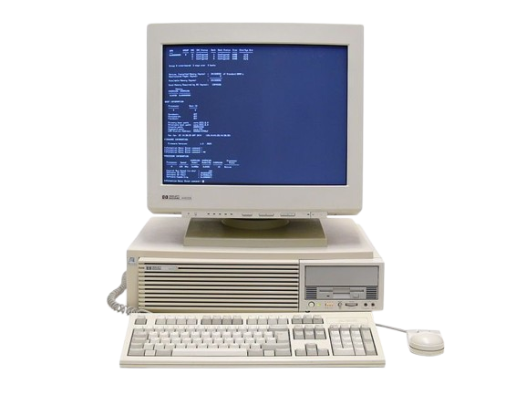

<table width="100%" style="margin-top:16px;border:1px solid #1a1a2e;background:#0a0a12;border-collapse:collapse">
<tr><td style="padding:14px 20px">
<pre style="color:#00ff88;font-family:'Share Tech Mono',monospace;font-size:12px;text-shadow:0 0 6px #00ff88;text-align:center;margin:0">
▓▓▓▓▓▓▓▓▓▓▓▓▓▓▓▓▓▓▓▓▓▓▓▓▓▓▓▓▓▓▓▓▓▓▓▓▓▓▓▓▓▓▓▓▓▓▓▓▓▓▓▓▓▓▓▓▓▓▓▓▓▓▓
 F E R R O P N G  ::  d a t a   a n a l y s t  ::  s y s t e m  o n
 ▸ kernel loaded   ▸ coffee: critical   ▸ uptime: ∞
▓▓▓▓▓▓▓▓▓▓▓▓▓▓▓▓▓▓▓▓▓▓▓▓▓▓▓▓▓▓▓▓▓▓▓▓▓▓▓▓▓▓▓▓▓▓▓▓▓▓▓▓▓▓▓▓▓▓▓▓▓▓▓</pre>
</td></tr>
</table>

---

## `/// WHOAMI ///`

<table width="100%" cellpadding="0" cellspacing="0" border="0">
<tr>
<td width="50%" valign="top" style="padding-right:14px">

&gt; whoami

<table width="100%" cellpadding="0" cellspacing="0" style="border:1px solid #1a1a2e;background:#0a0a12;margin-bottom:14px;border-collapse:collapse">
<tr><td style="padding:0 14px 0 14px">
 
<table width="100%" style="font-family:monospace;font-size:12px;border-collapse:collapse">
<tr><td style="color:#555566;white-space:nowrap;padding:4px 8px">user</td><td style="color:#00ff88;padding:4px 8px">ferropng</td></tr>
<tr><td style="color:#555566;white-space:nowrap;padding:4px 8px">name</td><td style="color:#00ff88;padding:4px 8px">eduardo ferro</td></tr>
<tr><td style="color:#555566;white-space:nowrap;padding:4px 8px">role</td><td style="color:#00ff88;padding:4px 8px">analista de dados</td></tr>
<tr><td style="color:#555566;white-space:nowrap;padding:4px 8px">company</td><td style="color:#00ff88;padding:4px 8px">evernex</td></tr>
<tr><td style="color:#555566;white-space:nowrap;padding:4px 8px">location</td><td style="color:#00ff88;padding:4px 8px">santo andré / sp</td></tr>
<tr><td style="color:#555566;white-space:nowrap;padding:4px 8px">edu</td><td style="color:#00ff88;padding:4px 8px">fiap · data science</td></tr>
<tr><td style="color:#555566;white-space:nowrap;padding:4px 8px">status</td><td style="color:#00ff88;padding:4px 8px">online · wip</td></tr>
<tr><td style="color:#555566;white-space:nowrap;padding:4px 8px">fuel</td><td style="color:#00ff88;padding:4px 8px">café + dados</td></tr>
</table>
 
</td></tr>
</table>

<table width="100%" cellpadding="0" cellspacing="0" style="border:1px solid #1a1a2e;background:#0a0a12;border-collapse:collapse">
<tr><td style="padding:0 14px 0 14px">
 

[ BIO ]

olá, eu sou o ferro. 
analista de dados por dia, 
explorador de dados à noite.  
apaixonado por python, sql, 
machine learning e por fazer 
dashboards que ninguém pediu. 
também gosto de macacos. 🐒

 
</td></tr>
</table>

</td>
<td width="50%" valign="top">

<table width="100%" cellpadding="0" cellspacing="0" style="border:1px solid #1a1a2e;background:#05050a;border-collapse:collapse">
<tr><td style="padding:16px">

[ AYANAMI REI ]

<pre style="color:#7b2fff;font-family:'Share Tech Mono',monospace;font-size:7px;line-height:1.22;text-shadow:0 0 4px #7b2fff;margin:0">AYANAMI REI                           __.-"..--,__
                             __..---"  | _|    "-_\
                      __.---"          | V|::.-"-._D
                 _--"".-.._   ,,::::::'"\/""'-:-:/
            _.-""::_:_:::::'-8b---"            "'
         .-/  ::::<  |\::::::"\
         \/:::/::::'\\ |:::b::\
         /|::/:::/::::-::b:%b:\|
          \/::::d:|8:::b:"%%%%%\
          |\:b:dP:d.:::%%%%%"""-,
           \:\.V-/ _\b%P_   /  .-._
           '|T\   "%j d:::--\.(    "-.
           ::d&lt;   -" d%|:::do%P"-:.   "-,
           |:I _    /%%%o::o8P    "\.    "\
            \8b     d%%%%%%P""-._ _ \::.    \
            \%%8  _./Y%%P/      .::'-oMMo    )
              H"'|V  |  A:::...:odMMMMMM(  ./
              H /_.--"JMMMMbo:d##########b/
           .-'o      dMMMMMMMMMMMMMMP""
         /" /       YMMMMMMMMM|
       /   .   .    "MMMMMMMM/
       :..::..:::..  MMMMMMM:|
        \:/ \::::::::JMMMP":/
         :Ao ':__.-'MMMP:::Y
         dMM"./:::::::::-.Y
        _|b::od8::/:YM::/
        I HMMMP::/:/"Y/"
         \'"'"  '':|
          |    -::::\
          |  :-._ '::\
          |,.|    \ _:"o
          | d" /   " \_:\.
          ".Y. \       \::\
           \ \  \      MM\:Y
            Y \  |     MM \:b
            >\ Y      .MM  MM
            .IY L_    MP'  MP
            |  \:|   JM   JP
            |  :\|   MP   MM
            |  :::  JM'  JP|
            |  ':' JP   JM |
            L   : JP    MP |
            0   | Y    JM  |
            0   |     JP"  |
            0   |    JP    |
            m   |   JP     #
            I   |  JM"     Y
            l   |  MP     :"
            |\  :-       :|
            | | '.\      :|
            | | "| \     :|
             \    \ \    :|
             |  |  | \   :|
             |  |  |   \ :|
             |   \ \    | '.
             |    |:\   | :|
             \    |::\..|  :\
              ". /::::::'  :||
                :|::/:::|  /:\
                | \/::|: \' ::|
                |  :::||    ::|
                |   ::||    ::|
                |   ::||    ::|
                |   ::||    ::|
                |   ': |    .:|
                |    : |    :|
                |    : |    :|
                |    :||   .:|
                |   ::\   .:|
               |    :::  .::|
              /     ::|  :::|
           __/     .::|   ':|
  ...----""        ::/     ::
 /m_  AMm          '/     .:::
 ""MmmMMM#mmMMMMMMM"     .:::m
    """YMMM""""""P        ':mMI
             _'           _MMMM
         _.-"  mm   mMMMMMMMM"
        /      MMMMMMM""
        mmmmmmMMMM"
                         ch1x0r</pre>
</td></tr>
</table>

</td>
</tr>
</table>

---

## `/// GALLERY ///`

<table width="100%" cellpadding="0" cellspacing="0" border="0">
<tr>
<td width="33.3%" style="padding:0 6px"></td>
<td width="33.3%" style="padding:0 6px"></td>
<td width="33.3%" style="padding:0 6px"></td>
</tr>
</table>

---

## `/// SKILLS ///`

&gt; ls ./skills

<table width="100%" cellpadding="0" cellspacing="0" border="0">
<tr>
<td width="33.3%" valign="top" style="padding:0 6px">
<table width="100%" cellpadding="0" cellspacing="0" style="border:1px solid #1a1a2e;background:#0a0a12;border-collapse:collapse">
<tr><td style="padding:14px 16px">

[ DATA STACK ]

├─ python 
├─ sql 
├─ pandas 
├─ numpy 
├─ scikit-learn 
└─ jupyter notebook

</td></tr>
</table>
</td>
<td width="33.3%" valign="top" style="padding:0 6px">
<table width="100%" cellpadding="0" cellspacing="0" style="border:1px solid #1a1a2e;background:#0a0a12;border-collapse:collapse">
<tr><td style="padding:14px 16px">

[ BI / VIZ ]

├─ power bi 
├─ matplotlib 
├─ seaborn 
├─ plotly 
├─ dashboards 
└─ data storytelling

</td></tr>
</table>
</td>
<td width="33.3%" valign="top" style="padding:0 6px">
<table width="100%" cellpadding="0" cellspacing="0" style="border:1px solid #1a1a2e;background:#0a0a12;border-collapse:collapse">
<tr><td style="padding:14px 16px">

[ MISC ]

├─ git / github 
├─ linux 
├─ estatística 
├─ regressão linear 
└─ séries temporais

</td></tr>
</table>
</td>
</tr>
</table>

---

## `/// INTERESTS ///`

<table width="100%" cellpadding="0" cellspacing="0" border="0">
<tr>
<td width="50%" valign="top" style="padding-right:14px">

<table width="100%" cellpadding="0" cellspacing="0" style="border:1px solid #1a1a2e;background:#05050a;border-collapse:collapse">
<tr><td style="padding:16px">

[ IKARI SHINJI ]

<pre style="color:#ff2fa0;font-family:'Share Tech Mono',monospace;font-size:5px;line-height:1.22;text-shadow:0 0 4px #ff2fa0;margin:0;white-space:pre">⠀⠀⠀⠀⠀⠀⠀⠀⠀⠀⠀⠀⠀⣀⣤⣤⣤⣤⣄⣀⣴⣿⣿⣿⣿⣿⣿⣿⣿⣿⣿⣿⣿⣿⣿⣿⣿⣿⣟⢿⣷⣦⣄⠀⠀⠀⠀⠀⠀⠀⠀⠀⠀⠀⠀⠀⠀⠀⠀⠀⠀⠀⠀⠀
⠀⠀⠀⠀⠀⠀⠀⠀⠀⢀⣤⣶⣿⣿⣿⣿⣿⣿⣿⣿⣿⣿⣿⣿⣿⣿⣿⣿⣿⣿⣿⣿⣿⣿⣿⣿⣿⣿⣿⣿⣷⡙⠻⣿⣷⣄⡀⠀⠀⠀⠀⠀⠀⠀⠀⠀⠀⠀⠀⠀⠀⠀⠀⠀⠀
⠀⠀⠀⠀⠀⠀⠀⣠⣾⣿⣿⣿⣿⣿⣿⣿⣿⣿⣿⣿⣿⣿⣿⣿⣿⣿⣿⣿⣿⣿⣿⣿⣿⣿⣿⣿⣿⣿⣿⣿⣿⣿⣦⠈⠻⣿⣿⣦⡀⠀⠀⠀⠀⠀⠀⠀⠀⠀⠀⠀⠀⠀⠀⠀⠀
⠀⠀⠀⠀⠀⣠⣾⣿⣿⣿⣿⣿⣿⣿⣿⣿⣿⣿⣿⣿⣿⣿⣿⣿⣿⣿⣿⣿⣿⣿⣿⣿⣿⣿⣿⣿⣿⣿⣿⣿⣿⣿⣿⣿⣦⣹⣿⣿⣿⣦⡀⠀⠀⠀⠀⠀⠀⠀⠀⠀⠀⠀⠀⠀⠀
⠀⠀⠀⠀⣴⣿⣿⣿⣿⣿⣿⣿⣿⣿⣿⣿⣿⣿⣿⣿⣿⣿⣿⣿⣿⣿⣿⣿⣿⣿⣿⣿⣿⣿⣿⣿⣿⣿⣿⣿⣿⣿⣿⣿⣿⣿⣿⣿⣿⢿⣶⣤⣀⣀⠀⠀⠀⠀⠀⠀⠀⠀⠀⠀
⠀⠀⢠⣾⣿⣿⣿⣿⣿⣿⣿⣿⣿⣿⣿⣿⣿⣿⣿⣿⣿⣿⣿⣿⣿⣿⣿⣿⣿⣿⣿⣿⣿⣿⣿⣿⣿⣿⣿⣿⣿⡧⣼⣿⣿⣿⣿⣿⣿⣿⣦⡀⠀⠀⠀⠀⠀⠀⠀⠀⠀⠀⠀⠀
⠀⢠⣿⣿⣿⣿⣿⣿⣿⣿⣿⣿⣿⣿⣿⣿⣿⣿⣿⣿⣿⣿⣿⣿⣿⣿⣿⣿⣿⣿⣿⣿⣿⣿⣿⣿⣿⣯⣿⣿⣿⣿⣾⣿⣿⣿⣿⣿⣿⣿⣿⣽⣧⡀⠀⠀⠀⠀⠀⠀⠀⠀⠀⠀
⢀⣿⣿⣿⣿⣿⣿⣿⣿⣿⣿⣿⣿⣿⣿⣿⣿⣿⣿⣿⣿⣿⣿⣿⣿⣿⣿⣿⣿⣿⣿⡿⣿⣿⣿⣿⣿⣿⣟⣿⣿⣿⣿⣿⣿⣿⣿⣿⣿⣿⣿⡿⣷⡈⢻⣆⠀⠀⠀⠀⠀⠀⠀⠀⠀
⢸⣿⣿⣿⣿⣿⣿⣿⣿⣿⣿⣿⣿⣿⣿⣿⣾⣿⣿⣿⣿⣿⣿⣿⣿⣿⣿⣿⣿⣿⣿⡇⢸⣿⣿⢿⣿⣿⣿⣿⣿⣿⣿⣿⣿⣿⣿⣿⣿⣿⣿⡌⠻⣦⡽⣆⠀⠀⠀⠀⠀⠀⠀⠀
⣿⢿⣿⣿⣿⣿⣿⣿⣿⣿⣿⣿⣿⣿⣿⣿⣿⣿⣿⣿⣿⣿⣿⣿⣿⣿⣿⣿⣿⣿⣿⢸⣧⠀⠹⣿⡎⢿⠙⢿⣿⣿⣿⡟⢿⣿⣿⣿⣿⣿⣿⣿⣿⣄⠈⠻⣾⣆⠀⠀⠀⠀⠀⠀⠀
⠏⢺⣿⣿⣿⣿⣿⣿⣿⣿⣿⣿⣿⣿⣿⣿⣿⣿⣿⣿⣿⣿⣿⣿⣿⣿⣿⣿⣿⡟⢸⡟⠀⠀⠸⣧⠈⣇⠀⠹⣿⣿⣿⣬⣿⣿⣿⣿⣿⣿⣿⣿⣿⡆⠀⠈⢻⡄⠀⠀⠀⠀⠀⠀
⠀⢸⣿⣿⣿⣿⣿⣿⣿⣿⣿⣿⣿⣿⣿⣿⣿⣿⣿⣿⣿⣿⣿⣿⡿⣿⣿⣿⡿⠁⢸⡇⠀⠀⠀⢻⡀⢸⣤⠞⠛⣿⠻⡇⠸⣿⣿⡟⠛⣿⣿⡟⣷⠙⣆⠀⠀⠙⠀⠀⠀⠀⠀⠀
⠀⠀⣿⣿⣿⣿⣿⣿⣿⣿⣿⣿⣿⣿⣿⣿⣿⣿⣿⣿⡿⣽⣿⡿⢁⣿⣿⣿⠃⠀⢸⠇⠀⠀⠀⢨⠟⠉⠀⠀⠀⠘⡆⠙⠀⢿⢻⣿⡜⣿⢹⡇⠘⣇⠈⠑⠀⠀⠀⠀⠀⠀⠀⠀
⠀⠀⢸⣿⣿⣿⣿⣿⣿⣿⣿⣿⣿⣿⣿⣿⡿⣿⣿⣿⡿⣿⣿⠋⠙⣿⣿⠏⠒⠉⡾⠀⠀⠀⢀⣿⣾⣿⡟⠉⠀⠀⠀⠀⠀⠘⠈⢿⡧⣿⠀⣇⠀⠘⡆⠀⠀⠀⠀⠀⠀⠀⠀⠀
⠀⠀⠀⢻⣿⣿⣿⣿⣿⣿⣿⣿⣿⣿⣿⣿⣿⢿⣿⠃⠀⢻⡏⢀⣴⣿⣟⡒⣶⣴⠃⠀⠀⠀⠸⠛⠛⢃⡤⢄⣀⣀⣀⣀⣤⡄⠀⣼⣷⠃⠀⠘⠀⠀⠀⠀⠀⠀⠀⠀⠀⠀⠀⠀
⠀⠀⠀⣸⣾⣿⣿⣿⣿⣿⣿⣿⣿⣿⣿⣿⡟⢸⡇⠀⠀⢸⡇⠉⠀⠟⠉⠙⠛⠋⠀⠀⠀⠀⠀⠀⠀⣿⡟⢿⣿⣍⣽⠀⢺⠁⠀⣿⠏⠀⠀⠀⠀⠀⠀⠀⠀⠀⠀⠀⠀⠀⠀⠀
⠀⠀⠀⠈⢻⡏⠉⡉⠻⣿⣿⣿⣿⡏⢻⣟⠇⢸⠃⠀⠀⠀⠁⣠⣴⣶⣶⡒⠀⠀⠀⠀⠀⠀⠀⠀⠀⠘⢷⡈⠛⠟⢃⣠⠞⠀⢸⡟⠓⠤⣄⠀⠀⠀⠀⠀⠀⠀⠀⠀⠀⠀⠀⠀
⠀⠀⠀⠀⠀⣷⡇⠙⡷⢼⣿⣿⣿⠁⢈⡿⠄⠀⣠⠤⠴⣶⣿⣏⣹⠛⣯⠀⠀⠀⠀⠀⠀⠀⠀⠀⠀⠀⠀⠉⠉⠉⠉⠀⡀⠀⣾⡀⢢⠀⠸⡄⠀⠀⠀⠀⠀⠀⠀⠀⠀⠀⠀⠀
⠀⠀⠀⠀⠀⢿⡇⠀⡇⠀⢈⡿⣿⡄⠸⣇⠀⠀⠛⢦⣄⠈⢛⣟⣫⠴⠋⠀⠀⠀⠀⠀⠀⠀⠀⠀⠀⠀⠀⠀⠀⠀⠃⠉⠀⠀⢹⢧⡼⠀⢰⠷⣄⠀⠀⠀⠀⠀⠀⠀⠀⠀⠀⠀
⠀⠀⠀⠀⠀⠘⣿⡇⠃⠀⢿⣀⡘⢧⡀⠹⣆⠀⠀⠀⠀⠉⠉⠀⠀⠀⠀⠀⠀⠀⠀⠀⠀⢀⣆⣄⠀⠀⠀⠀⠀⠀⠀⠀⠀⠀⣸⡾⠁⠀⠈⠀⡼⢟⠒⠤⣀⡀⠀⠀⠀⠀⠀⠀
⠀⠀⠀⠀⠀⠀⠈⠛⠲⢤⣄⠈⢁⠀⠁⠀⡹⣦⠀⠀⠀⢘⣆⣀⣀⣀⠀⠀⠀⠀⠀⠀⠀⣼⣿⣿⣿⠆⠀⠀⠀⠀⠀⠀⠀⣠⠟⠀⠀⠀⠀⡼⡇⠈⢧⠀⠈⠁⠀⠀⠀⠀⠀⠤
⠀⠀⠀⠀⠀⠀⠀⠀⠀⠀⢈⣹⠿⠚⠛⠉⠉⠉⠉⠉⠻⠯⠥⠴⣋⣸⠀⠀⠀⠀⠀⠀⠀⠙⠿⠿⠁⠀⠀⠀⠀⠀⠀⠀⡰⠋⠀⠀⠀⠀⢸⠁⣿⠀⠈⢳⠀⠀⠀⣴⠛⠁⠀⠀
⠀⠀⠀⠀⠀⠀⠀⠀⠀⢰⣯⠶⠖⠒⠛⠉⠉⣙⠳⠶⠶⢶⣾⡿⠛⠁⠀⠀⠀⠀⠀⠀⠀⠀⠀⢰⣤⠀⠀⠀⠀⠀⢠⠞⠁⠀⠀⢀⡀⠀⡎⠀⣏⠀⠀⠀⠀⠀⠀⠈⢷⡀⢠⣾
⠀⠀⠀⠀⠀⠀⠀⠀⠀⢸⠏⠀⠀⠀⢀⣴⣾⠟⢛⢿⣋⠉⢧⡀⠀⠀⠀⠀⠀⠀⠀⠀⠴⣶⡿⠟⠃⠀⠀⠀⢀⡴⠃⠀⠀⠀⢠⡟⠀⢸⡇⠀⡿⠀⠀⠀⠀⠀⠀⠀⠈⣷⣸⣿
⠀⠀⠀⠀⠀⠀⠀⠀⠀⡾⠀⠀⠀⠀⣸⡟⠁⠀⡞⠀⠉⠳⢦⣉⣻⣦⣤⣤⣄⡀⠀⠀⠀⠀⠀⠀⠀⠀⠀⢠⠟⠀⠀⠀⠀⠀⠀⡇⠀⢸⠁⠀⡇⠀⠀⠀⠀⠀⠀⠀⠀⣸⣿⣿
⠀⠀⠀⠀⠀⠀⠀⠀⡼⠃⠀⠀⠀⣰⡟⠀⠀⡼⠁⠀⠀⠀⣠⠞⠉⢀⣀⣄⠀⢹⡆⠀⠀⠀⠀⠀⠀⢰⡷⠛⠒⠒⢤⣀⡀⠀⢰⠀⠀⡌⠀⢰⠃⠀⠀⠀⠀⠀⠀⣠⣾⢿⣿⣿
⠀⠀⠀⠀⣀⡤⠖⠚⠙⠚⠛⠳⠶⠿⠧⠤⠴⢥⣤⣀⠀⡼⢡⡶⠛⠉⣠⠞⣴⡾⠯⣶⣤⣀⠀⢀⣠⡾⣷⠀⠀⠀⠀⢸⠁⢠⠊⠀⠀⡇⠓⡇⠀⠀⠀⠀⠀⣠⡾⠋⢠⣿⣿⣿
⠀⠀⠀⢀⣧⠖⠂⠀⠀⠀⠀⠀⠀⠀⠀⠀⠀⠀⠀⠈⠙⣧⡟⠀⠀⣼⢿⡾⠉⠛⣦⡀⠀⠈⠉⠉⠀⠀⢞⡆⠀⠀⠀⡜⠀⠁⠀⠀⠀⡇⢰⡁⠀⠀⠀⡠⠚⠉⠳⣄⣬⣿⣿⣿
⠀⠀⠀⠉⠁⠀⠀⠛⠶⢤⣤⣤⣴⣖⣒⡒⠲⣤⣄⠀⢀⡏⠀⠀⢸⣇⡾⠁⠀⠀⠀⠙⢶⡀⠀⠀⠀⠀⠸⣿⠀⠀⢸⡇⠀⠀⠀⠀⢸⠁⠀⠉⢲⡴⠊⠀⠀⠀⠀⠈⠣⡽⣿⣿
⡀⠀⠀⠀⠀⠒⠂⠆⠀⠀⠀⠀⠀⠈⠉⠉⠓⠲⣬⣦⣟⡁⠀⠀⣨⣿⣿⣦⡚⣻⣤⠀⠀⢻⡆⠀⠀⠀⢰⣿⠀⠀⠀⠹⡄⠀⠀⠀⢸⠀⣀⡴⠋⠀⠀⠀⠀⠀⠀⠀⠀⠁⢾⣿</pre>
</td></tr>
</table>

</td>
<td width="50%" valign="top">

&gt; cat interests.txt

<table width="100%" cellpadding="0" cellspacing="0" style="border:1px solid #1a1a2e;background:#0a0a12;margin-bottom:14px;border-collapse:collapse">
<tr><td style="padding:0 14px 0 14px">
 

[ INTERESSES ]

<table width="100%" style="font-family:monospace;font-size:12px;border-collapse:collapse">
<tr><td style="color:#555566;white-space:nowrap;padding:4px 8px">data science</td><td style="color:#ff2fa0;padding:4px 8px">[✓ core]</td></tr>
<tr><td style="color:#555566;white-space:nowrap;padding:4px 8px">machine learning</td><td style="color:#ff2fa0;padding:4px 8px">[✓ studying]</td></tr>
<tr><td style="color:#555566;white-space:nowrap;padding:4px 8px">business intelligence</td><td style="color:#ff2fa0;padding:4px 8px">[✓ power bi]</td></tr>
<tr><td style="color:#555566;white-space:nowrap;padding:4px 8px">data viz</td><td style="color:#ff2fa0;padding:4px 8px">[✓ dashboards]</td></tr>
<tr><td style="color:#555566;white-space:nowrap;padding:4px 8px">estatística</td><td style="color:#ff2fa0;padding:4px 8px">[✓ applied]</td></tr>
<tr><td style="color:#555566;white-space:nowrap;padding:4px 8px">séries temporais</td><td style="color:#ff2fa0;padding:4px 8px">[✓ forecast]</td></tr>
<tr><td style="color:#555566;white-space:nowrap;padding:4px 8px">anime</td><td style="color:#ff2fa0;padding:4px 8px">[✓ evangelion]</td></tr>
<tr><td style="color:#555566;white-space:nowrap;padding:4px 8px">música</td><td style="color:#ff2fa0;padding:4px 8px">[✓ spotify on]</td></tr>
</table>
 
</td></tr>
</table>

<table width="100%" cellpadding="0" cellspacing="0" style="border:1px solid #1a1a2e;background:#0a0a12;border-collapse:collapse">
<tr><td style="padding:0 14px 0 14px">
 

[ STATUS ]

atualmente: estudando 
machine learning, modelos 
preditivos e regressão linear. 
também tentando prever o futuro 
com dados do spotify.

 
</td></tr>
</table>

<table width="100%" cellpadding="0" cellspacing="0" border="0" style="margin-top:14px">
<tr>
<td width="50%" style="padding-right:6px"></td>
<td width="50%" style="padding-left:6px"></td>
</tr>
</table>

</td>
</tr>
</table>

---

## `/// CERTIFICAÇÕES ///`

&gt; cat ~/certs.log

<table width="100%" cellpadding="0" cellspacing="0" border="0">
<tr>
<td width="50%" valign="top" style="padding-right:14px">
<table width="100%" cellpadding="0" cellspacing="0" style="border:1px solid #1a1a2e;background:#0a0a12;border-collapse:collapse">
<tr><td style="padding:14px 16px">

[ ALURA ]

├─ power bi: dashboard 
├─ product manager 
├─ data science: explorando 
├─ data science: hipóteses 
├─ séries temporais 
├─ regressão linear 
├─ ML: classificação sklearn 
├─ python: primeiros passos 
└─ python + sql

</td></tr>
</table>
</td>
<td width="50%" valign="top" style="padding-left:14px">
<table width="100%" cellpadding="0" cellspacing="0" style="border:1px solid #1a1a2e;background:#0a0a12;border-collapse:collapse">
<tr><td style="padding:14px 16px">

[ UDEMY ]

└─ sql para análise de dados: 
&nbsp;&nbsp;&nbsp;do básico ao avançado

 

[ FORMAÇÃO ]

└─ fiap · data science 
&nbsp;&nbsp;&nbsp;[ in progress ]

</td></tr>
</table>
</td>
</tr>
</table>

---

## `/// PROJETOS ///`

&gt; ls ./projects

<table width="100%" cellpadding="0" cellspacing="0" style="border:1px solid #1a1a2e;background:#0a0a12;border-collapse:collapse">
<tr><td style="padding:14px 16px">
<table width="100%" style="font-family:monospace;font-size:12px;border-collapse:collapse">
<tr>
<td style="color:#7b2fff;padding:6px 8px;white-space:nowrap">[python]</td>
<td style="color:#c8c8d8;padding:6px 8px"><a href="https://github.com/ferropng/Spotify-Rewind" style="color:#00e5ff;text-decoration:none">Spotify-Rewind</a></td>
<td style="color:#555566;padding:6px 8px">rewind dos seus hits do ano</td>
</tr>
<tr>
<td style="color:#7b2fff;padding:6px 8px;white-space:nowrap">[jupyter]</td>
<td style="color:#c8c8d8;padding:6px 8px"><a href="https://github.com/ferropng/BioGuard" style="color:#00e5ff;text-decoration:none">BioGuard</a></td>
<td style="color:#555566;padding:6px 8px">análise de dados espaciais</td>
</tr>
<tr>
<td style="color:#7b2fff;padding:6px 8px;white-space:nowrap">[html]</td>
<td style="color:#c8c8d8;padding:6px 8px"><a href="https://github.com/ferropng/Global-Primates-Watch" style="color:#00e5ff;text-decoration:none">Global-Primates-Watch</a></td>
<td style="color:#555566;padding:6px 8px">macacos em foco 🐒</td>
</tr>
<tr>
<td style="color:#7b2fff;padding:6px 8px;white-space:nowrap">[jupyter]</td>
<td style="color:#c8c8d8;padding:6px 8px"><a href="https://github.com/ferropng/Classificacao-de-musicas-do-Spotify" style="color:#00e5ff;text-decoration:none">Classificacao-de-musicas-do-Spotify</a></td>
<td style="color:#555566;padding:6px 8px">ml + áudio features</td>
</tr>
</table>
</td></tr>
</table>

---

## `/// NOW PLAYING ///`

&gt; now_playing --stream

<iframe style="border-radius:0;display:block;width:100%;height:352px;border:0" src="https://open.spotify.com/embed/playlist/6o7Go6dkcRHaxLOF3Oclze?utm_source=generator&si=ba82722cf76848fe" width="100%" height="352" frameBorder="0" allowfullscreen="" allow="autoplay; clipboard-write; encrypted-media; fullscreen; picture-in-picture" loading="lazy"></iframe>

---

## `/// GALLERY 2 ///`

<table width="100%" cellpadding="0" cellspacing="0" border="0">
<tr>
<td width="50%" style="padding:0 6px"></td>
<td width="50%" style="padding:0 6px"></td>
</tr>
</table>

---

## `/// GIT STATS ///`

&gt; git log --stats

  

  

---

## `/// CONNECT ///`

&gt; connect --all

---

 

<pre style="font-size:10px;color:#555566;text-align:center;font-family:monospace">
░░░░░░░░░░░░░░░░░░░░░░░░░░░░░░░░░░░░░░░░░░░░░░░░░░░░░░░░░░
 [ terminal session ended ]  ·  [ errors: a few ]  ·  [ uptime: still going ]
░░░░░░░░░░░░░░░░░░░░░░░░░░░░░░░░░░░░░░░░░░░░░░░░░░░░░░░░░░</pre>

sempre aberto a colaboração em projetos de dados

